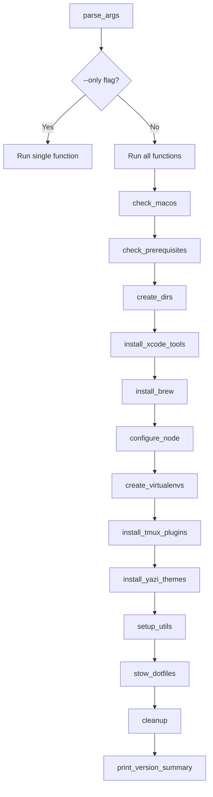

# Architecture

This page explains the design principles and structure of the dotfiles repository.

## Design Philosophy

### Simplicity is King

The simplest solution that works is the best solution. Every tool and configuration earns its place by solving a real problem.

### Functional Core, Imperative Shell

```
┌─────────────────────────────────┐
│         Interfaces              │  ← CLI (update command)
├─────────────────────────────────┤
│         Side Effects            │  ← Package managers, file I/O
├─────────────────────────────────┤
│         Core Logic              │  ← Pure shell functions
└─────────────────────────────────┘
```

### Idempotent Operations

Every operation can be run multiple times with the same result. The `update` command is safe to run anytime.

## Directory Structure

```
dotfiles/
├── aerospace/           # AeroSpace window manager
├── bin/                 # Custom CLI tools
│   ├── aliases          # Interactive alias browser
│   └── tools            # Installed tools explorer
├── docs/                # This documentation (VitePress)
├── fzf/                 # Fuzzy finder configuration
├── ghostty/             # GPU-accelerated terminal
├── git/                 # Git configuration
├── nvim/                # Neovim + LazyVim
├── scripts/             # Install script modules
│   ├── logging.sh       # Logging utilities
│   ├── ui.sh            # Table drawing
│   └── versions.sh      # Version tracking
├── sesh/                # tmux session manager
├── starship/            # Cross-shell prompt
├── tmux/                # Terminal multiplexer
├── yazi/                # Terminal file manager
├── zsh/                 # Shell configuration
├── Brewfile             # Homebrew packages
├── install.sh           # Main installer
├── AGENTS.md            # AI agent conventions
└── SKILL.md             # Repository knowledge
```

## Install System

### Pipeline

```
run.sh (bootstrap) → install.sh (main) → scripts/*.sh (modules)
```

### Module Responsibilities

| Module | Purpose |
|--------|---------|
| `install.sh` | CLI parsing, orchestration, function execution |
| `logging.sh` | `log()`, `log_error()`, `spinner`, `execute()` |
| `ui.sh` | `draw_table()`, `print_section()` |
| `versions.sh` | Version detection, `--outdated`, `--all` |

### Function Flow



## GNU Stow

[GNU Stow](https://www.gnu.org/software/stow/) manages symlinks from the repository to your home directory.

### How It Works

Each directory is a "package" that mirrors the target structure:

```
dotfiles/zsh/           →  $HOME/
├── .zshrc              →  ~/.zshrc
├── .aliases            →  ~/.aliases
└── .exports            →  ~/.exports

dotfiles/nvim/          →  $HOME/
└── .config/nvim/       →  ~/.config/nvim/
    ├── init.lua        →  ~/.config/nvim/init.lua
    └── lua/            →  ~/.config/nvim/lua/
```

### Commands

```bash
# Symlink a package
stow -d ~/dotfiles -t ~ zsh

# Re-symlink (fix conflicts)
stow --restow -d ~/dotfiles -t ~ zsh

# Remove symlinks
stow -D -d ~/dotfiles -t ~ zsh
```

## Version Tracking

The system tracks tool versions before and after installation:

```bash
# Get current version
get_version "bat"  # → "0.25.0"

# Track changes
track_version "bat" "$old_version"

# Print summary table
print_version_summary
```

### Supported Managers

| Manager | Detection |
|---------|-----------|
| Homebrew | `brew info --json` |
| UV | `uv tool list` |
| Cargo | `cargo install --list` |
| Git | Commit hash from repo |

## Shell Startup

```
┌─────────────┐
│  .zshenv    │  Environment variables (PATH, etc.)
└──────┬──────┘
       ↓
┌─────────────┐
│  .zprofile  │  Login shell setup (Homebrew)
└──────┬──────┘
       ↓
┌─────────────┐
│  .zshrc     │  Interactive shell (plugins, aliases)
├─────────────┤
│  .exports   │  Tool-specific exports
│  .aliases   │  Aliases and functions
└─────────────┘
```

## AI Agent Support

The repository includes documentation for AI assistants:

| File | Purpose |
|------|---------|
| `AGENTS.md` | Development conventions for all languages |
| `SKILL.md` | Repository-specific knowledge |

These files help AI tools understand the codebase and follow project conventions.
